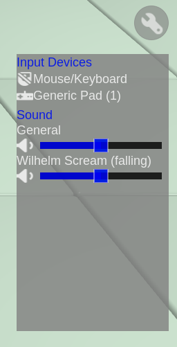
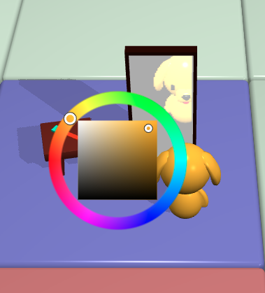
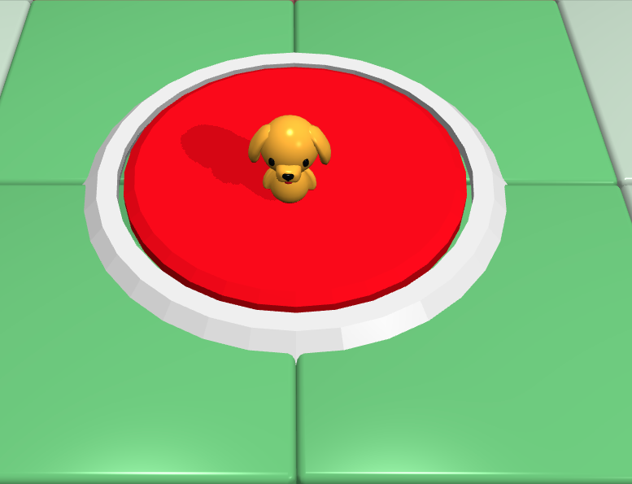

# colyseus lobby for babylon

A babylon.js/WebGL frontent for rendering a lobby using colyseus.io for multiplayer network.

## Features

- Suport for mobile (touchscreen), Mouse&Keyboard as well as gamepads.
  - allowing local splitscreen by running multiple browser windows and (de)activating controller.
- Individual controller configuration and configuration of different sounds.

- Color selection

- Character selection

- A big start button to start your game

(Note that this is only the lobby, it does NOT implement a full game, take a look at my Global Game Jam 2021 game [Puppy Search Brawl](https://github.com/brean/puppy-search-brawl) )

## Assets

Using the cute 3D Assets by Kay Lousberg (www.kaylousberg.com)

License: (Creative Commons Zero, CC0)
http://creativecommons.org/publicdomain/zero/1.0/
